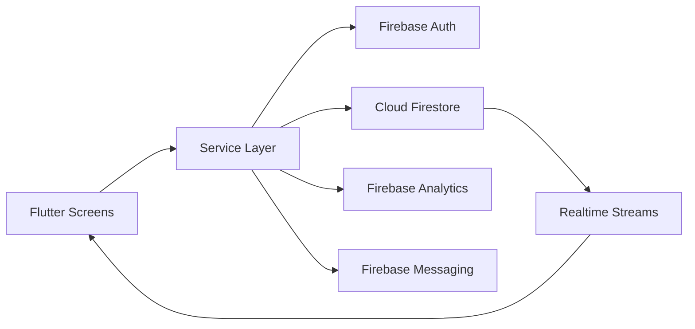

# GST Billing SaaS App

Smart GST billing and business operations app built with Flutter + Firebase.

[](https://flutter.dev/)
[](https://firebase.google.com/)
[](https://firebase.google.com/docs/firestore)
[](https://firebase.google.com/docs/auth)
[](https://flutter.dev/multi-platform)

## Why This Project

This app is designed as a mini SaaS billing system, not a UI-only prototype.
It supports secure multi-user access, multi-company data isolation, recurring billing, GST calculations, and live financial reporting.

## Core Features

- Authentication
  - Register/Login/Logout with Firebase Auth
  - Auth gate with persisted session handling
- Multi-company support
  - Add/Edit/Delete company
  - Active company switcher in app bar
  - All business data scoped per selected company
- Business modules
  - Clients CRUD
  - Products CRUD
  - Invoices CRUD
  - Reminders CRUD
  - Recurring invoices with pause/resume and auto-generate
- Billing engine
  - GST slab handling (0/5/12/18/28 in calculator + invoices)
  - Same-state logic: CGST + SGST
  - Different-state logic: IGST
  - Payment tracking: paid amount, balance amount, payment history
- Reporting and exports
  - Monthly revenue report
  - GST summary report
  - Top clients report
  - CSV exports
- Security
  - Firestore rules scoped to authenticated user path
  - Role-aware invoice delete rule (admin/owner only)

## Architecture



## Project Structure

```text
lib/
├── models/
├── screens/
├── services/
├── theme/
└── widgets/
```

## Firestore Data Model

```text
users/{uid}
  - profile fields
  - role (admin/staff)
  - activeCompanyId
  activityLogs/{logId}
  clients/{clientId}                 # legacy migration support
  products/{productId}               # legacy migration support
  invoices/{invoiceId}               # legacy migration support
  reminders/{reminderId}             # legacy migration support
  companies/{companyId}
    - company profile fields
    clients/{clientId}
    products/{productId}
    invoices/{invoiceId}
    reminders/{reminderId}
    recurringInvoices/{recurringId}
    analytics/{eventId}
```

## Firebase Setup

1. Create or use project: `rohandb-58168`
2. Enable Authentication provider:
   - `Authentication > Sign-in method > Email/Password`
3. Configure FlutterFire:

```bash
dart pub global activate flutterfire_cli
flutterfire configure --project=rohandb-58168 --platforms=android,ios,web
```

4. Deploy Firestore rules:

```bash
firebase deploy --only firestore:rules --project rohandb-58168
```

## Local Development

```bash
flutter clean
flutter pub get
flutter analyze
flutter test
flutter run -d chrome
```

## Web Notes (FCM)

This repo includes web service worker support:

- `web/firebase-messaging-sw.js`

If push notifications are not needed in local web debug, app still runs safely without crashing.

## QA Status

- Analyzer: no issues
- Widget tests: passing
- Runtime smoke checks: completed on Chrome debug

## Roadmap

- Invoice PDF generation and upload to Firebase Storage
- Cloud Functions for scheduled recurring invoice generation
- Extended charting and financial drill-downs
- CI workflow for analyze + test + rules validation

